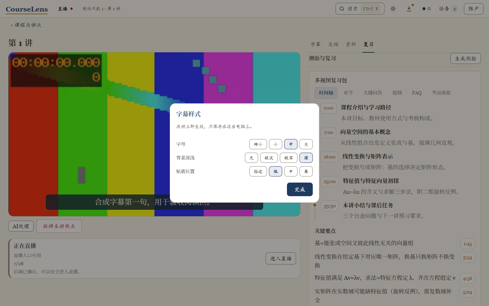
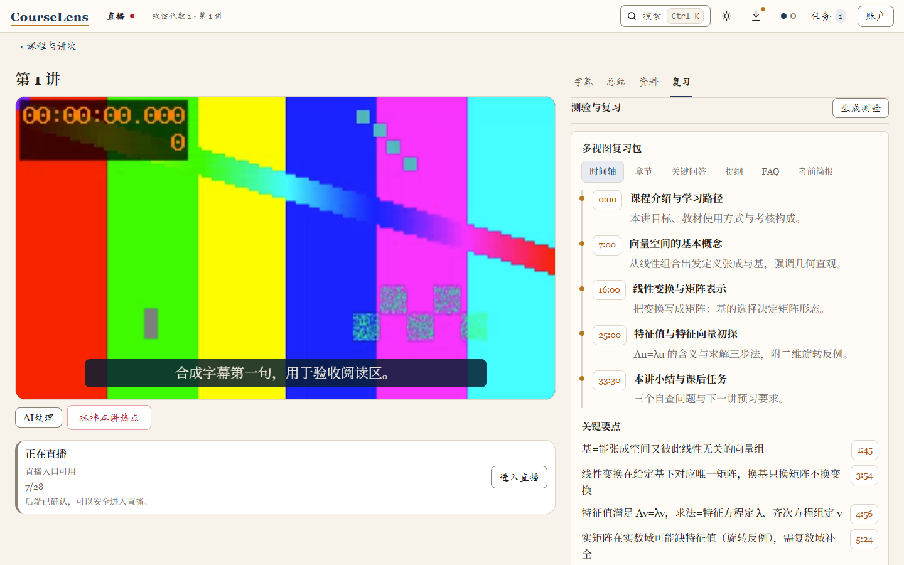
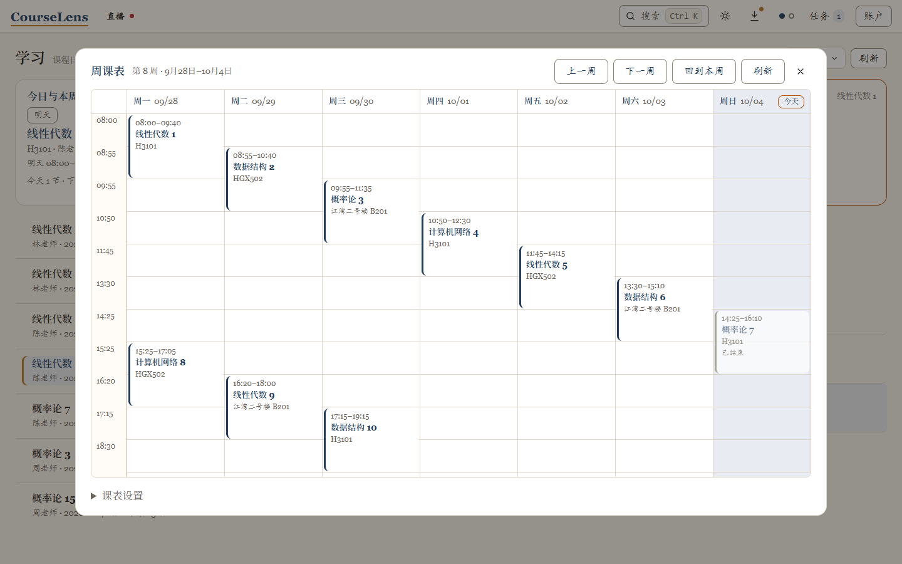
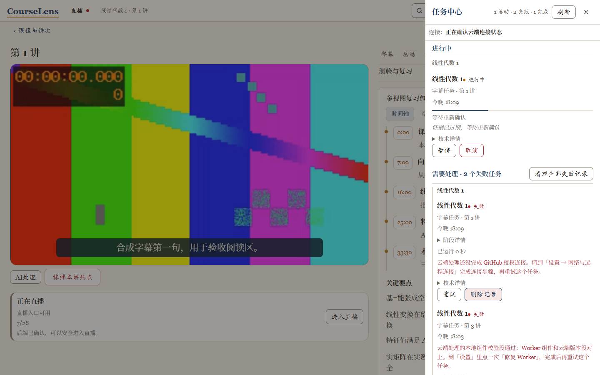

# Fudan CourseLens

CourseLens 是给复旦学生的 Windows 学习客户端。看录播自动出字幕；总结、章节这些复习材料，点一下就开始生成。直播、课表也在里面。数据默认留在你自己的电脑上。

**[下载 CourseLens for Windows](https://github.com/gualtier-xu/Fudan-CourseLens/releases/latest)**（约 24 MB）｜当前版本 **0.1.0**｜问题反馈：[Issues](https://github.com/gualtier-xu/Fudan-CourseLens/issues)

不确定从哪读起：想先弄清数据的事，直接看[安全与隐私架构](#安全与隐私架构)；想看它长什么样、日常怎么用，有[产品介绍页](https://gualtier-xu.github.io/Fudan-CourseLens/)（截图导览版），或往下读[它能帮你做什么](#它能帮你做什么)。

录播播放器：句级字幕自动生成，字号、背景、贴底位置随手调，改动只存在这台电脑上。图中均为合成课程数据，不含真实账号或课程信息。

## 三步开始

顺利的话，一两分钟就能装完进入学习台。

1. **下载**：到[发布页](https://github.com/gualtier-xu/Fudan-CourseLens/releases/latest)下载 `CourseLens-0.1.0-setup.exe`。
2. **安装**：双击 setup.exe。如果 Windows 弹出「已保护你的电脑」，点「更多信息」→「仍要运行」，每一步长什么样见[《Windows 安全提示图文指引》](https://github.com/gualtier-xu/Fudan-CourseLens/releases/download/client-v0.1.0/windows-security-prompt.md)。安装包只负责第一次安装，以后的更新都在应用内完成，不要重跑 setup.exe。
3. **登录选课**：按首跑引导用复旦统一身份认证登录。学号密码只输入客户端本地的安全表单，经 Windows DPAPI 加密后才存盘。选你有权访问的课程就能开始。想用 AI 校对与问答，可以在设置里填入你自己的 DeepSeek API Key；这是可选项，不填也有高精度的非 AI 字幕回退。

装好之后每天怎么用，见客户端帮助中心的《快速上手》；首跑、授权与故障恢复的完整说明在内置的《学生新手教程》里。

### macOS 测试版（体验版）

mac 版还在早期测试，先给 Apple Silicon（M 系列）的 Mac 试用，系统要求 macOS 12 或更新版本。想尝鲜的同学到[发布页](https://github.com/gualtier-xu/Fudan-CourseLens/releases)下载带「Pre-release」标记的 macOS 测试版。它由 CI 自动构建，还没在真机上深度实测，可能遇到没料到的问题；遇到了请到 [Issues](https://github.com/gualtier-xu/Fudan-CourseLens/issues) 说一声，每一条都有人回。

首次打开可能被 macOS 拦一下：Apple 公证需要按年付费的开发者资质，测试版还没办。在访达里右键点 CourseLens 选「打开」，再点一次「打开」；如果没有这个选项，到 系统设置 → 隐私与安全性，点 CourseLens 旁边的「仍要打开」。每台电脑只需要一次。

数据规矩与 Windows 版完全一致：课程、字幕、总结都在你自己的电脑上，学号密码加密存进 macOS 钥匙串，没有遥测。托盘最小化、应用内更新和每日定时任务测试版暂时没有，其余功能照常。

## 它能帮你做什么

每天用得到的就这几件：字幕、复习材料、提问、课表。

- **录播与直播，自动出字幕**：下课即看，不用等平台审核：客户端自动发现你有权访问的课程，录播自动转写字幕，经多道校对（可选 AI 校对＋自动抽检），质量优于平台自带字幕；播放器支持倍速、字幕样式、影院模式与全套快捷键。直播课有专属入口和实时字幕，有直播的时候入口才会出现。直播转写为早期功能，可用性视网络与课程环境而定。
- **复习材料，点一下就开始生成**：总结、章节、要点、关键问答和测验自动归到同一讲下面，点时间戳就跳回原话；生成后自动做一次质量抽检，讲次卡上写结论：「通过」或「N 处存疑」。课件 PDF 也能合成进来，中途断了能接着跑。

复习页全貌。

- **提问与解释**：对这门课提问，回答基于这门课的字幕、章节和课件证据，每条都带可跳转的时间戳引用；看不懂的地方按 `X` 插一面「没听懂」小旗，AI 结合前后文把那段讲清楚，懂了可以删掉。
- **课表、检索与任务中心**：本科生和研究生的课表都能读，可切换学期与周次，也能导出 ICS 日历；课程与讲次全文按 `Ctrl K` 检索；云端任务进行到哪一步、失败原因是什么，任务中心用中文写着，可以重试。

周课表。

任务中心。

同一门课处理得越多，它记住的术语和讲法越多，后面的总结和问答会自动带上这门课沉淀下来的例句和术语。到复习的时候，回看热点会在进度条上标出你的难点，疑问标记、测验与复习路径帮你安排复习。

## 安全与隐私架构

装新工具之前，先问清楚两件事：数据存在哪，谁能看到。下面按 CourseLens 的实际行为回答，不谈空泛承诺。

### 你的数据在哪里

- 课程目录、课表、字幕、笔记和任务状态保存在你电脑上的 CourseLens 本机数据目录；本地服务只监听本机回环地址，不向局域网或外网开放。
- 学号、密码和 API Key 只允许在客户端本地安全表单输入，经 Windows DPAPI 加密后存盘：文件里只有密文，日志、界面和诊断输出都不会回显它们。
- 你的电脑上没有任何 AI 模型，也不做本地推理：字幕识别、OCR、总结、问答这些重活全部在你的专属云端 Worker 上执行，学生机保持轻巧。
- 学习统计默认关闭；开启后记录的也只是你本机的观看数据，可随时关闭或按学期删除。
- 界面外观（浅色/深色/自动主题）纯为本机显示偏好：主题选择只存在你电脑的界面存储里，切换主题只改颜色，不新增任何外联目标。
- 卸载时会问「要保留你的学习数据吗」：选「是」，笔记、字幕、进度原地不动，哪天重装回来一切如旧；选「否」才是真删，不可恢复。想不卸载、只清空重来，设置的危险区有逐项清单确认后的「客户端重置」。受管安装（脚本直装）在「设置 → 应用」里同样可以一键卸载，默认也保留学习数据。想连数据一起删：运行安装目录里的卸载脚本加 -RemoveData，输入大写 Y 确认才会真删。

### 谁能看到什么

- 每个云端任务都带一只端到端加密的「任务信封」：拉取课件或媒体的任务会在信封里放入所需的校方会话凭据（Worker 用它以你的身份拉取这门课的资源），开了 AI 校对的任务会带上你的 DeepSeek Key。信封只密封给你自己的专属 Worker（解封钥匙只存在于你的 Worker 环境密钥里），GitHub 与传输链路上只见密文，CourseLens 作者侧读不到内容。
- 任务结果全程加密回传，你的专属云端仓库只作加密暂存：最长保留 30 天，过期不再可用；你可以随时撤销授权或手动清理。
- GitHub App 按最小权限安装：首装后引导你把安装范围收紧为仅两个受管仓库（你的专属公共 Worker 与私有 Mailbox），不覆盖你账号下的其他仓库，也不请求账单或用量读取权限。
- 凭据托管只有当你显式开启「自动学习材料」时才发生：该功能在工作日每节课下课约半小时后的固定时点和每晚 22:00（北京时间）检查新讲座并生成已选课程的学习材料，受账号熔断保护（按日限制讲次、runner 分钟与 token 用量）；开启前有逐项披露清单等你确认。不开它，一切任务都由你手动发起。
- 浏览器只拿到短期、不透明的播放会话，不会获得上游 Cookie 或永久媒体地址。
- 在诚实边界之内，客户端对课件加了防泄露护栏：视频与页面图的右键另存、拖拽导出、Ctrl+S/U 快捷键都被拦截，输入框复制粘贴与课程列表拖拽不受影响。护栏挡的是「顺手扩散」，不承诺对抗蓄意技术手段：浏览器拿到可播放字节后，仍可能被技术工具抓取或录屏，CourseLens 不虚假宣称 DRM。

### 客户端会和哪些服务器通信

外联目标在代码里是一张固定闭集表（服务探针定义于 `src/runtime/network.py` 的 `SERVICE_PROBES`）；表之外没有任何统计、埋点或上报端点，CourseLens 没有遥测。下表是当前源码树中全部 10 个固定外联主机，由审计逐主机与代码对账得出。播放回放与直播的媒体地址由学校课程平台在授权会话内返回，同样只属学校服务：校内直连，校外经下表的学校官方通道中转，中转目标在代码里有白名单限定。

| 主机 | 用途 |
| --- | --- |
| `id.fudan.edu.cn` / `webvpn.fudan.edu.cn` / `icourse.fudan.edu.cn` / `fdjwgl.fudan.edu.cn` / `yjsxktest.fudan.sh.cn` | 复旦统一身份认证、课程与课表数据（含研究生课表数据源）；其中 webvpn.fudan.edu.cn 也是学校官方的校外访问通道 |
| `github.com` 与 `api.github.com` | GitHub 授权、专属仓库与学习任务 |
| `api.deepseek.com` | AI 校对与摘要（可选，使用你自己配置的 DeepSeek Key） |
| `release-assets.githubusercontent.com` / `objects.githubusercontent.com` | 应用更新时下载更新包与清单（更新链专用：逐跳白名单+IP 钉定，仅 HTTPS） |

### 原生窗口壳的对外动作清单

安装版打开的是 CourseLens 自己的原生窗口（而非浏览器标签页）。这个窗口壳对外做的事也有一张固定闭集清单，逐条可核对：

- **外链只出不进**：点击网页里的外部链接时，只放行 http/https 且非本应用地址的链接，交给你的系统默认浏览器打开；`javascript:`、`file:`、`data:` 等一律拒绝，窗口本身绝不会被导航去外部网站。
- **只跟本机服务说话**：窗口加载的页面与任务进度（任务栏进度条、托盘悬停的任务计数）都来自本机回环地址上的 CourseLens 本地服务，不产生任何新的外联目标。
- **清理界面缓存有边界**：数据管理页的「清理界面缓存」只删除窗口自己的网页缓存目录，学习数据、课程与登录状态不受影响；采用「按钮登记、下次启动生效」的两步设计，你会先看到将要发生什么。
- **关窗语义透明**：默认点 × 即退出（在飞任务会先一次性确认）；开启「关闭窗口时最小化到托盘」后，托盘菜单的「退出」才是真正关闭。窗口标题恒为「CourseLens」，重复启动时只把已有窗口带到前台。

### 出问题时怎么表现

- 错误一律以闭集状态码和中文文案呈现：目录暂时失败不会被伪装成账号登出，凭据被拒会直说，不让你猜。
- 更新清单必须通过签名校验，验不过一律拒绝安装；升级采用「应用内自动检查 + 你手动确认安装」，默认不静默：有新版本时告诉你，装不装、什么时候装由你决定。
- 登录阶段的诊断只写入本地严格脱敏的文件，绝不外发。同一条纪律双方都遵守：不要把凭据放进 Issue、命令、截图、日志或任何聊天里。

### 我们自己怎么核对

以上不是口号，是三项可复核的工程事实：

- **敏感值静态扫描零发现**：内容级敏感值扫描（gitleaks）以全量默认规则运行，当前零真实凭据发现。豁免只有两处，都摆在明面上：客户端仓仅豁免两条自带的合成负测试常量（测试夹具里的假 Key），公开 Worker 镜像仓仅按路径豁免一个模型安装脚本（已知误报）。
- **外联主机闭集对账**：上表 10 个主机与源码逐主机核对一致；代理自动检测也只接受本机回环地址的代理。
- **公开 Worker 镜像三方恒等**：公开 Worker 仓库是 CI 用 Ed25519 签名生成的只读镜像；发布核验了签名文档哈希在签名 manifest、本地离线导出与公共仓库三方逐字节恒等，你运行的 Worker 就是被审计过的那一份。

《隐私与数据说明》与本节保持同一口径，在「设置 → 查看《隐私与数据说明》」可以打开；删除、导出与恢复操作见内置的《设置与隐私指南》。

### 测试身份边界

CourseLens 的每个版本发布前都会经过大量自动化测试。这些测试怎么做、用到什么身份，我们同样摆在明面上，不让你猜：

- **你的安装与你的数据，测试结构性碰不到**：测试实例一律使用独立的专用数据目录与专用端口段（17700-17999），与真装实例（默认数据目录、6268 默认端口）物理隔离；需要了解真装状态时只做只读健康检查，任何测试操作都不会写入你的学习数据。
- **测试用的是专用测试账号，不是任何用户的账号**：GitHub 侧自动化测试使用一个开发者自有的专用测试账号（已明确降级为测试用途）；它的凭据只存放在开发者本机的加密凭据目录里，从不进入代码仓库、安装包、日志或任何产物。
- **测试登录态按「等效凭据」管理**：测试账号的网页登录态文件存放在开发者工作区的专用目录（不进入 git 仓库），文件权限收紧到仅当前用户可读，并支持一键整体删除重建（轮换）；学校 UIS 凭据等级更高——**从不**建立持久测试会话文件，每次自动化测试需要时临时在内存注入、用完即逝。
- **测试流量同样受外联闭集约束**：测试过程不会引入上表之外的新主机；自动化登录遇到验证码、两步验证等安全挑战时一律即停转人工，不代批、不暴力重试。
- **测试和你互不打扰**：测试专用浏览器实例使用独立配置目录，清理时按目录指纹精确匹配、逐进程处理，你正在使用的浏览器窗口永远不在测试的清理范围内。

### 为什么安装时 Windows 会拦一下

首次安装时，Windows 可能弹出「已保护你的电脑」。原因如实说：CourseLens 目前没有购买代码签名证书，那是给安装包办的「数字身份证」，对现阶段的学生项目是一笔不小的固定开支；没有这张身份证，Windows 对每款新软件的默认态度都是先拦下来问问你，与软件本身好坏无关。装好之后的每次更新都要通过更新清单签名校验，验不过一律拒绝安装，坏包进不了你的电脑。逐步截图与常见拦截情形（包括 Smart App Control 用户的注意事项）见三步开始里的《Windows 安全提示图文指引》。

## 装之前可能想问

**我的学习数据会被传到网上吗？**

字幕识别和总结这些重活确实要在云端做，但每个任务都装在端到端加密信封里：GitHub 与传输链路上只见密文，解封钥匙只在你自己的 Worker 环境密钥里。除上一节的固定清单外没有任何通信，也没有遥测。

**校外能用吗？**

看回放多数情况不需要你做任何设置：客户端自动走学校官方的校外通道，用的是你登录客户端的复旦账号会话。打不开时，先确认浏览器能正常登录 [webvpn.fudan.edu.cn](https://webvpn.fudan.edu.cn)，再回客户端点播放器里的「重新获取播放授权」。开着 Clash 类工具的「TUN 模式 / 虚拟网卡」时，即使在校园网里也可能看不了，关掉再试；普通的「系统代理」模式一般不影响。设置页的「复旦课程平台」卡里可以运行一次连接诊断。

**开代理（VPN）能用吗？**

能用，互不干扰。只是下载安装包、应用更新和云端学习任务需要能访问 GitHub：如果你的网络直连 GitHub 不稳（安装包下不动、云端任务一直不结束），开着代理再试即可。

**以后升级要重新安装吗？**

不要重跑 setup.exe。应用内自动检查更新，有新版本时告诉你，你确认后才会安装；更新包验签不过就拒绝安装。

**遇到报错怎么办？**

任务中心会用中文写明失败原因，多数问题按提示重试或按步骤修复就行。解决不了就去 [Issues](https://github.com/gualtier-xu/Fudan-CourseLens/issues) 反馈，每一条报障都有人回，说的是人话；贴截图前先脱敏，不要出现学号、密码和真实课程名。「设置 → 更新与帮助」里的诊断信息本身已严格脱敏，可以直接截图。

## 开发者入口

架构、API、数据库、目录结构、代理规则、测试和发布流程见技术 README（`docs/technical/README.md`），版本历史见 `docs/changelog.md`。

---

<small>CourseLens 的灵感来自 [LeafCreeper/Fudan_iCourse_Subscriber](https://github.com/LeafCreeper/Fudan_iCourse_Subscriber)。谢谢 LeafCreeper，也谢谢每一位报过问题、提过建议的同学。</small>
