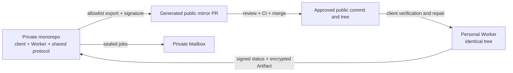
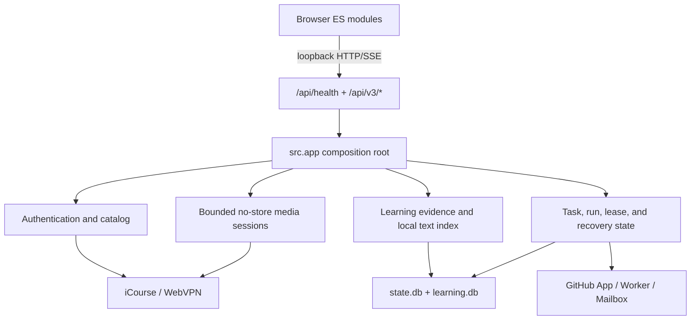

# CourseLens project overview

CourseLens is an online-only desktop learning client for Fudan iCourse content
that the current student is authorized to access. The private monorepo is the
only source of truth for the client, Worker, and shared protocol. The public
Worker is a signed CI-generated mirror; each personal Worker and private
Mailbox remains a separate client-managed repository.

Live-room observations are an independent local domain. Authorization is
rechecked at status, grant consumption, and every HLS resource. The feature
does not alter Worker wire protocol v2 and never delegates platform credentials
or live media to the public Worker.

## System boundary

The exporter rejects unknown files, links, path escapes, private imports, and
non-canonical text. Before dispatch, the client verifies the pinned public
commit/tree, root-signed trust metadata, release key status, manifest and file
digests, protocol compatibility, and personal Worker tree equality.

## Runtime architecture

The browser never receives upstream URLs, cookies, bearer tokens, or local
paths. Media is relayed in bounded ranges with `Cache-Control: private,
no-store`; supported runtime directories contain no original media or
transcodes. ASR, OCR, summary, chapter, and quiz generation are remote Worker
operations. The local process authenticates, streams, indexes derived text,
verifies evidence, and imports encrypted results.

## Product and state

The UI provides Courses, Learning, Search, Tasks, Timetable, and Settings
workspaces. It supports authorized catalog discovery, online playback,
subtitles, evidence-backed learning material, bookmarks, quizzes, review,
concepts, local opt-in analytics, remote recovery, GitHub Device Flow, and
student timetable/ICS export.

The backend is authoritative. User actions may enter a checking state, but the
UI shows success only after backend or signed remote evidence confirms it.

- `runtime/data/state.db`: catalog, tasks, operations, runs, leases, timetable,
  and migration registry.
- `runtime/data/learning.db`: subtitles, documents, search, alignment, quiz,
  review, concepts, and local analytics.
- `runtime/data/credentials.json`: platform-protected credential ciphertext.
- `runtime/cache`, `runtime/logs`, and `runtime/reports`: rebuildable cache,
  redacted logs, and local hash-based validation evidence.

`CatalogRepository` is the only course and lecture catalog source. There is no
`manifest.json` migration path or local download state.

## Supported runtime and status

Windows uses project-local `tools/python310` and `.venv-client-py310`; the
launcher starts `python -m src serve`. The client does not install or invoke
FFmpeg, local ASR/OCR models, CUDA environments, a local learning Worker, or a
system Python fallback. macOS has CI/import/package smoke coverage, not a native
installer or credential-store acceptance claim.

The Windows client now contains a signed-update subsystem with synthetic
managed-install/rollback coverage plus sandbox rehearsal and real-machine
refresh acceptance runs recorded in the release checklist and ops pack.
macOS client auto-update remains unsupported/unknown;
its existing CI/import/package smoke coverage is unchanged.

The approved distribution target is the public
`gualtier-xu/Fudan-CourseLens-Worker-Release` GitHub Releases portal (ADR 0006;
official repository finalized 2026-09-30): anonymous
release discovery/download behind the signed-manifest trust hierarchy, with
`client-v<semver>` tags and a draft-then-publish release flow. Releases
ship with the updater in "auto-check + manual confirm" mode (not silent);
update-manifest signature verification stays fail-closed, so a rejected
manifest never installs. Code signing (Authenticode) is intentionally
deferred at the student-project stage — user-facing integrity guidance is the
published SHA-256 checksum sheet plus in-app update-manifest signature
verification, and remaining hardening items are tracked in
`docs/release-checklist.md`. The old private `Fudan-CourseLens-Releases`
repository has been deleted, so no legacy distribution host exists to fall
back to.

The online-only migration and physical legacy cleanup are complete. The beta
safety audit is release-ready. Manual full-lecture scoring and the optional
three-course content-quality study were withdrawn by the user and are not open
tasks. iCourse live classroom integration remains a separate future feature.

Start with [project handoff](handoff.md), then see [ADR 0001](adr/0001-private-monorepo-public-worker-mirror.md),
[ADR 0003](adr/0003-online-only-client-and-legacy-removal.md), and the
[technical README](technical/README.md).
